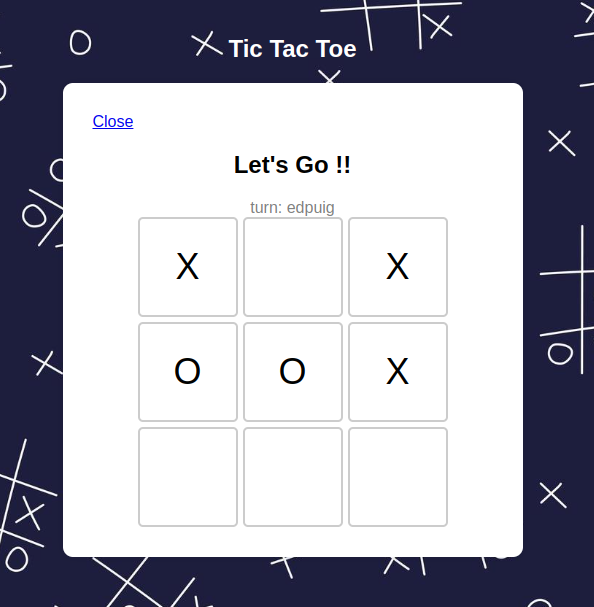

# Tic Tac Toe Game



## Index
1. [Introduction](#introduction)
2. [Quick Guide](#quick-guide)
3. [Api Docs](#api-docs)
4. [Prerequisites](#prerequisites)
5. [Dependencies](#dependencies)
6. [Installing Docker](#installing-docker)
7. [How run the Project](#how-run-the-project)
8. [How run the project with docker?](#how-run-the-project-with-docker)


## Introduction
This document will walk you through the process of setting up the project, including installing Docker, running basic Docker commands, and understanding the dependencies required. By the end of this guide, you will be able to run the Tic Tac Toe game both locally and within a Docker container. 

For more information on the software architecture, please visit this [link](./docs/arquitecture.md).

## Quick Guide 
Go to this page [Quick Quide through out Web Page](./docs/quickguide.md)

## Api Docs
Go to this page [Api Doc](./docs/endpoints.md)

## Prerequisites
Before installing Docker, ensure you have the following:
- A 64-bit operating system.
- Administrative privileges on your machine.

## Dependencies
```
pydantic==2.5.3
django==5.0.7
channels[daphne]==4.1.0
pyjwt==2.8.0
inject==5.2.1
channels-redis==4.2.0
python-decouple==3.8
```

## Installing Docker

Check this links:
1. For windows: [How install docker on Windows?](https://docs.docker.com/desktop/install/windows-install/)
2. For Mac: [How install docker on Mac?](https://docs.docker.com/desktop/install/mac-install/)
3. For Linux: [How install docker on Linux](https://docs.docker.com/desktop/install/linux-install/)

## How run the project


Prerequisites:
1. A redis server up. You can use one of the docker defined services, check this [How run the project with docker?](#how-run-the-project-with-docker)
2. python3 installed and configurated. 
3. Write access in the root folder of the project.

> **Note:**
> The below commands are for linux OS. Change these according your OS. If you have trouble with this, please check this topic. [How run the project with docker?](#how-run-the-project-with-docker). 

Follow this steps:
1. Create a virtual environment, you can use tools like [virtualenv](https://virtualenv.pypa.io/en/latest/), [pipenv](https://pipenv.pypa.io/en/latest/), [venv](https://docs.python.org/3/library/venv.html), etc. 
2. Activate your environment 
```bash
source env/bin/activate
```

3. Go to app folder
```bash
cd app
```
4. Run the migrations.
```bash
python manage.py migrate
```
5. Define the following envaironment variables in the `.env` file.
```bash
REDIS_CHANNEL_HOST=localhost
REDIS_CHANNEL_PORT=6379
```

6. Run the server
```bash
python manage.py runserver 8080
```

7. Make an healthcheck request to the API to check if is running. 
```bash
curl --location 'localhost:8080/api/v1/health'
```

## How run the project with docker

Run this command in your terminal. 
```bash
docker compose -f ./deployments/docker-compose.yml up 
```
