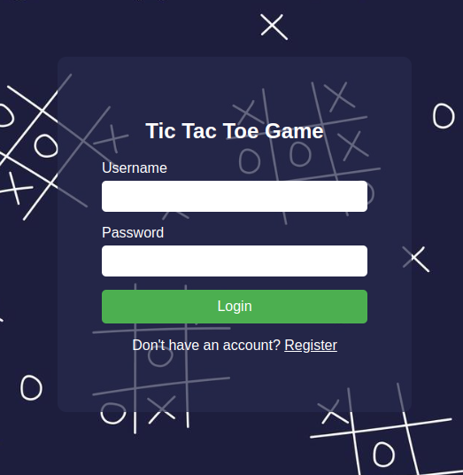
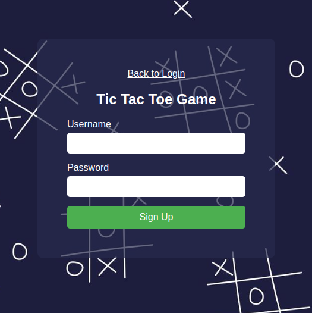
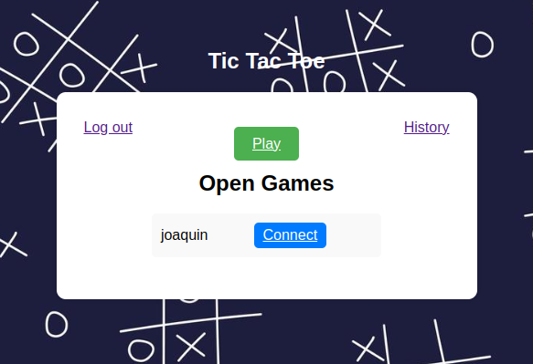
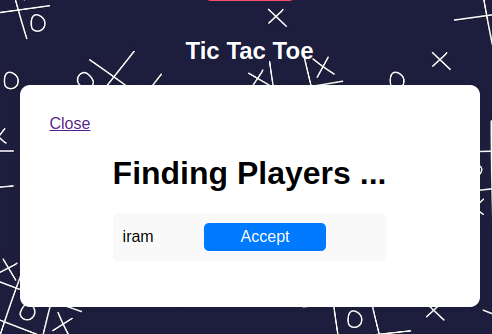
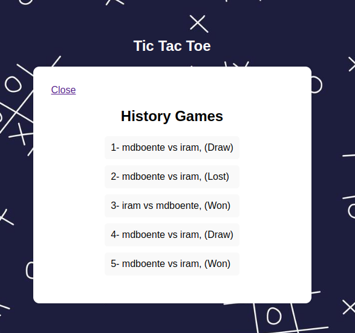

# Quick Guide on WEB app

## Index
1. [Login and Register](#login-and-register)
3. [Understanding the Home View](#understanding-the-home-view)
4. [Start a new game](#start-a-new-game)
5. [Play a game](#play-a-game)
6. [Where to see the history game?](#where-to-see-the-history-game)

## Login and Register
Type in the browser this url `http://localhost:8080` (update the host if yoe have configurated a new one) . You can see the login page. Complete the form and click on login button. 

If you don't have any account follow the `Register` link and go to the Register page. Complete the form and Sign up.

.

Both flows if you complete with the right values bring you to the Home View. 

## Understanding the Home View.

In this top left there is the logout button. In the top right the history botton (Go to this topic [History View](#where-to-see-the-history-game)).
In the center you have all open session to connect. If you connect with one of this session the app follow you to an waitting room until the host approve your request. In the top you have a Play button to start a new session as a host.  

## Start a new game
When you click on the Play button, the app find players to start a game. If someone user request connect to your session you should to receive a notification like this. 

To close the game, just click on the Close button. 

## Play a Game

Just Play!! if you start a game as a host your item to mark is a cross (X) and the guest is a nought (O), and viceversa. 

When the game is over all the result is saved, you can check these records in the next topic. 

## Where to see the history game?
On the top right of the home view you can see the History button that follow you to the History View. Once in the history view you can see all the last five results with the scores (Won,Lost,Draw).

